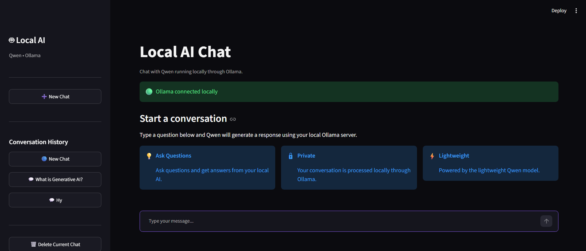
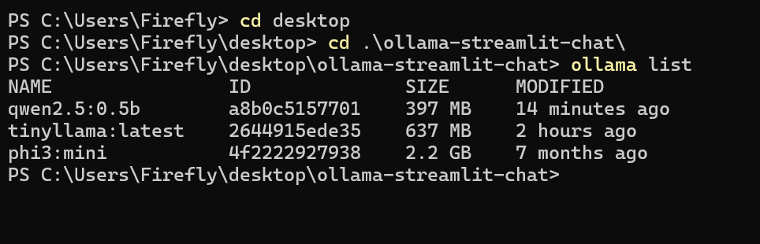
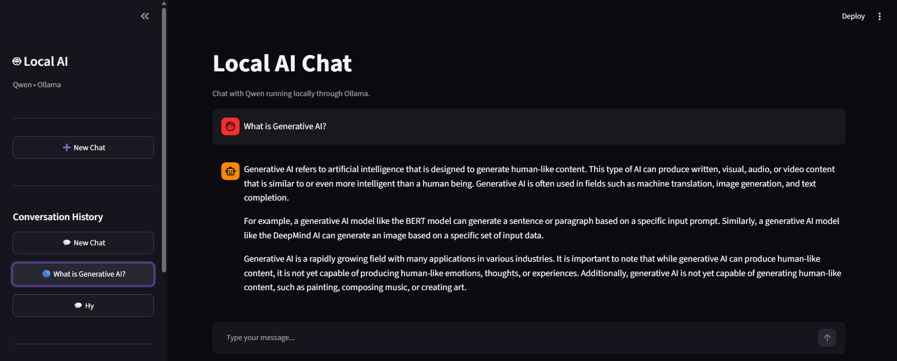
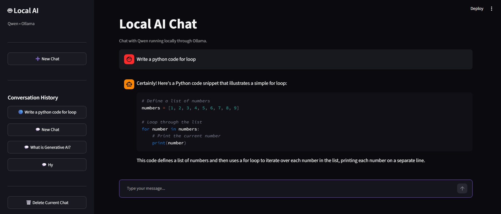

# Task 1 – Streamlit Interface for Local LLM Inference

A simple and interactive Streamlit web interface for interacting with a locally hosted Large Language Model (LLM) running through Ollama.

## 📌 Project Overview

This project was developed as part of the **Arch Technologies Internship – Generative AI Domain**.

The objective of this task was to build a Streamlit-based interface that connects to a locally installed LLM through Ollama. The application allows users to enter queries through a chat input and displays the model-generated responses in the interface.

The application communicates with the locally running Ollama service through its REST API and includes basic conversation management features such as conversation history and a reset option.

## ✨ Features

* Interactive Streamlit chat interface
* Text input for user queries
* AI-generated response display
* Local LLM inference using Ollama
* Qwen2.5 0.5B local model
* Conversation history panel
* Create a new conversation
* Reset/delete the current conversation
* Local JSON-based conversation storage
* Basic error handling for Ollama connection and request failures

## 🛠️ Technologies Used

| Technology   | Purpose                                |
| ------------ | -------------------------------------- |
| Python       | Application development                |
| Streamlit    | Interactive web interface              |
| Ollama       | Local LLM runtime                      |
| Qwen2.5 0.5B | Locally hosted language model          |
| Requests     | Communication with the Ollama REST API |
| JSON         | Local conversation storage             |

## 📂 Project Structure

```text
Task-01-Streamlit-Local-LLM/
│
├── .streamlit/
│   └── config.toml
│
├── data/
│   └── chats.json
│
├── screenshots/
│   ├── ollama-model.png
│   ├── streamlit-interface.png
│   ├── ai-response.png
│   └── conversation-history.png
│
├── app.py
├── ollama_client.py
├── chat_store.py
├── requirements.txt
├── .gitignore
└── README.md
```

> **Note:** `data/chats.json` stores local conversation data and is excluded from Git through `.gitignore`.

## 🔄 Application Workflow

```text
User Query
    ↓
Streamlit Interface
    ↓
Python Application
    ↓
Ollama REST API
    ↓
Qwen2.5 0.5B
    ↓
Generated Response
    ↓
Streamlit Interface
```

## 🔌 Ollama Integration

The application connects to the locally running Ollama service through its REST API endpoint:

```text
http://127.0.0.1:11434/api/chat
```

The model used for inference is:

```text
qwen2.5:0.5b
```

The Python application sends the conversation messages to Ollama and receives the generated response.

## 💻 Installation

### 1. Clone the Repository

```bash
git clone <YOUR-GITHUB-REPOSITORY-URL>
```

### 2. Navigate to the Task Directory

```bash
cd Task-01-Streamlit-Local-LLM
```

### 3. Create a Virtual Environment

```bash
python -m venv .venv
```

### 4. Activate the Virtual Environment

For Windows PowerShell:

```powershell
.\.venv\Scripts\Activate.ps1
```

### 5. Install Dependencies

```bash
pip install -r requirements.txt
```

## 🤖 Ollama Setup

Make sure Ollama is installed and running on your system.

Download the required model:

```bash
ollama pull qwen2.5:0.5b
```

Verify the installed model:

```bash
ollama list
```

You can also test the model directly:

```bash
ollama run qwen2.5:0.5b
```

## ▶️ Run the Application

Start the Streamlit application:

```bash
streamlit run app.py
```

The application will open in your web browser.

## 💬 Example

Enter a query in the Streamlit chat input, for example:

```text
What is Generative AI? Explain it in simple terms.
```

The query is sent to the locally hosted Qwen2.5 model through Ollama, and the generated answer is displayed in the Streamlit interface.

## 🗂️ Conversation History

The application includes a conversation history panel that allows users to manage previous conversations.

Users can:

* View previous conversations
* Open an existing conversation
* Continue an existing conversation
* Create a new conversation
* Reset/delete the current conversation

Conversation data is stored locally in:

```text
data/chats.json
```

The conversation data file is excluded from Git using `.gitignore`.

## 🧩 Main Components

### `app.py`

Contains the main Streamlit interface and handles:

* Chat interface
* User input
* Displaying model responses
* Conversation history
* Creating new conversations
* Resetting/deleting the current conversation

### `ollama_client.py`

Handles communication between the Streamlit application and the locally running Ollama service through its REST API.

It sends the conversation messages to the configured Qwen2.5 model and returns the generated response.

### `chat_store.py`

Handles local conversation storage using JSON.

It provides functionality for:

* Creating conversations
* Loading conversations
* Updating conversations
* Deleting conversations

## 📸 Screenshots

### Streamlit Interface



### Local Ollama Model



### AI Response



### Conversation History



## 🎯 Task Requirements Covered

This project implements the main requirements of Task 1:

* **Streamlit Interface:** Interactive web interface built using Streamlit.
* **Local LLM:** Connected to the locally installed Qwen2.5 0.5B model through Ollama.
* **User Input:** Provides a chat input for entering user queries.
* **Response Area:** Displays model-generated answers in the chat interface.
* **Local Communication:** Uses the Ollama REST API through a local endpoint.
* **Conversation History:** Provides a panel for accessing previous conversations.
* **Reset Functionality:** Allows the user to create a new conversation and reset the current chat.

## 🎯 Learning Outcomes

This task provided practical experience with:

* Building interfaces with Streamlit
* Connecting a frontend interface to a locally hosted LLM
* Using Ollama for local LLM inference
* Communicating with a REST API from Python
* Managing conversational messages
* Storing conversation data locally using JSON
* Implementing basic error handling

## 🚀 Future Improvements

Possible future improvements include:

* Streaming responses from the local model
* Adding support for selecting different installed Ollama models
* Improved response formatting
* Markdown rendering for model responses
* More advanced conversation management
* Integration of Retrieval-Augmented Generation (RAG)

## 👩‍💻 Internship Information

**Name:** Minahil Shah
**Internship Domain:** Generative AI
**Organization:** Arch Technologies

---

## 📄 Project Status

**Completed – Task 1**

The application provides an interactive Streamlit interface connected to a locally hosted Qwen2.5 0.5B model through Ollama, with user input, model-generated responses, conversation history, and reset functionality.
